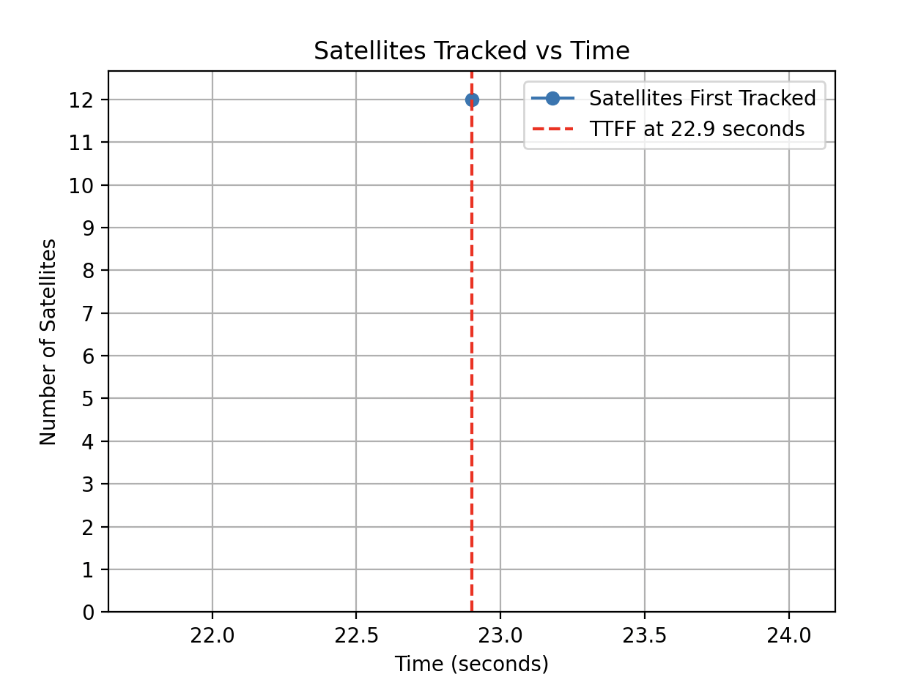

# NMEA Data Parser

This repository contains a Python-based tool designed to parse NMEA logs. This tool has two features:

1. Processes NMEA sentences to extract relevant data and provides insights into the number of satellites tracked over time and the Time to First Fix (TTFF) and plot it.
2. Parse live NMEA data and process it.

## Table of Contents

- [Setup and Installation](#setup-and-installation)
- [Usage](#usage)
    - [Offline NMEA Log File Processing](#offline-nmea-log-file-processing)
    - [Live NMEA Data Stream Processing](#live-nmea-data-stream-processing)
- [Configuration](#configuration)

## Setup and Installation

### Dependencies

You will need python 3.9 or later installed. See here for installation steps for your machine.

### Installing Poetry

Poetry is a dependency management and packaging tool for Python. To install Poetry:

```bash
pip install poetry
```

To verify install, run `poetry --version` and verify you get the version output.

### Setting Up the Project

1. **Clone the Repository**:
   ```bash
   git clone https://github.com/StanKatsyuk/NMEA-Data-Parser.git
   cd NMEA-Data-Parser
   ```

2. **Install Dependencies using Poetry**:
   ```bash
   poetry install
   ```

## Usage

### Offline NMEA Log File Processing

```bash
poetry run python main.py process-offline-file -i <input file path to NMEA log file>
```

A plot should be displayed
{:width="100px" height="50px"}


### Live NMEA Data Stream Processing

(Note: This implemenation is theoretical and has not been fully tested)

```bash
poetry run python main.py process-live-data --serial-port /dev/ttyUSB0 --baudrate 9600 --parity N --stopbit 1

```

## Configuration
- For live stream processing, ensure the correct UART port and baud rate are specified.
